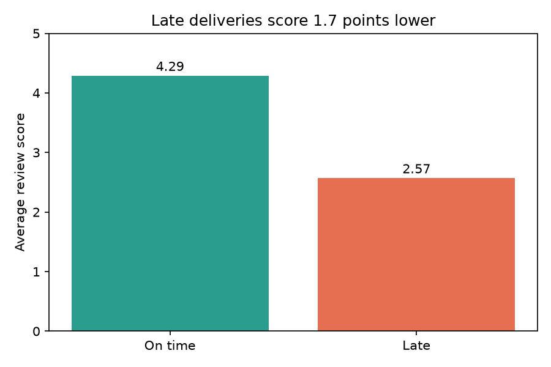
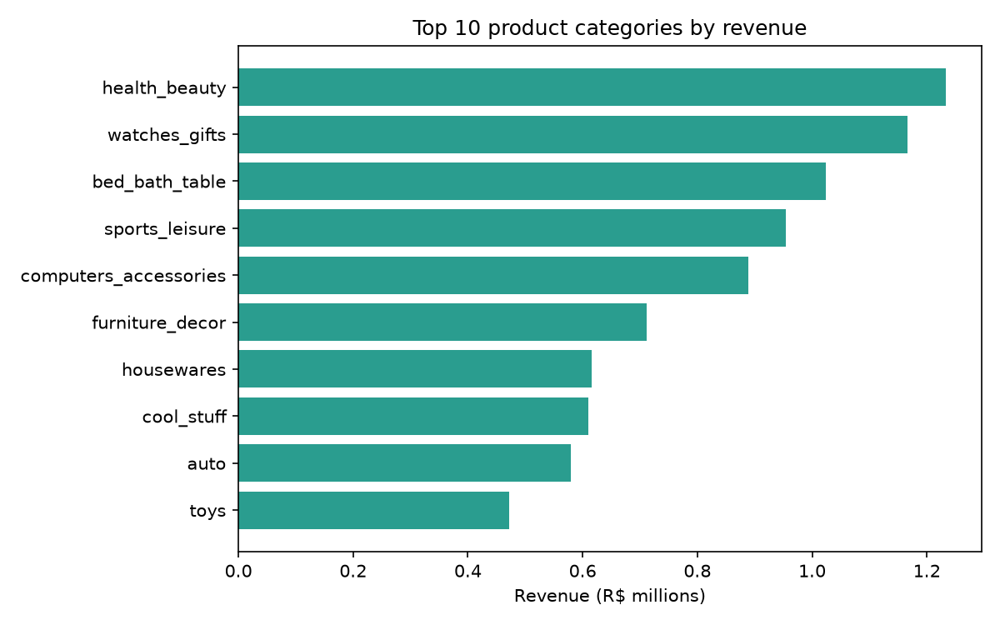
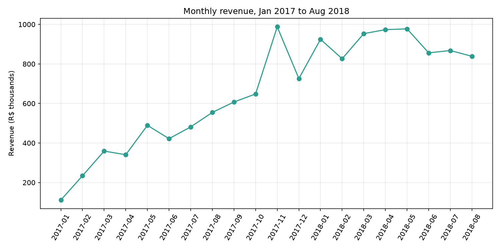

# Olist E-commerce Sales & Customer Analysis

End-to-end analysis of ~100K orders from Olist, a Brazilian online marketplace (2017-2018). I used SQL, Python, and data visualization to answer four business questions: what drives revenue, how sales change over time, whether customers come back, and how delivery affects satisfaction.

**Tools:** Python (Pandas, Matplotlib), SQL (SQLite), Jupyter Notebook, Git/GitHub
**Dataset:** [Brazilian E-Commerce Public Dataset by Olist](https://www.kaggle.com/datasets/olistbr/brazilian-ecommerce) (Kaggle)

## Key Findings

### 1. Late deliveries hurt customer satisfaction
- 97% of orders were delivered (96,470 kept for analysis). Average delivery time was 12.1 days.
- 8.1% of orders arrived after the estimated date.
- Late orders average a review score of **2.57**, versus **4.29** for on-time orders, a 1.7-point gap.



### 2. Revenue is concentrated in a few categories
- The top 10 categories generate **62.4%** of total revenue.
- Health & beauty leads (R$1.23M), followed by watches & gifts (R$1.17M) and bed, bath & table (R$1.02M).
- Watches & gifts earns almost as much as health & beauty from about 36% fewer orders, thanks to a higher revenue per order (~R$212 vs ~R$143).



### 3. Revenue grew 7.5x, then levelled off
- Monthly revenue rose from R$112K (Jan 2017) to R$839K (Aug 2018).
- November 2017 was the peak month (R$988K, 7,289 orders), driven by Black Friday.
- In 2018, revenue held at about R$0.83M to R$0.98M per month with no clear further growth.



### 4. Almost no customers buy twice
- 97% of customers (90,557 of 93,358) purchased only once in the period.
- Repeat purchase rate is about 3% whether the first order got 1 star (2.75%) or 5 stars (3.12%).
- No strong link was found between first-order satisfaction and repeat buying.

## Recommendations
1. **Improve delivery reliability.** Late orders are only 8% of volume but cause the biggest drop in reviews.
2. **Build retention separately.** Better delivery raises satisfaction but does not explain the low repeat rate. Test follow-up emails, loyalty offers, and product recommendations.
3. **Prioritize high-value categories.** Watches & gifts and similar categories bring strong revenue per order.
4. **Plan for seasonality.** Prepare stock and logistics ahead of November peaks.

## Limitations
- The dataset covers about 2 years, so "bought once" means once within this period.
- Revenue uses item prices only (no shipping).
- Repeat-purchase rates by review score rest on small groups, so results show no strong relationship, not proof of none.

## Project Structure
```
olist-ecommerce-sales-analysis/
├── notebooks/   01_data_exploration.ipynb, 02_sql_analysis.ipynb
├── sql/         revenue, monthly trend, repeat customer queries
├── dashboard/   charts (PNG)
├── data/        (not uploaded; download from Kaggle)
└── README.md
```

## How to Run
1. Download the dataset from Kaggle and place the CSV files in `data/`.
2. `python3 -m venv venv && source venv/bin/activate`
3. `pip install pandas numpy matplotlib seaborn jupyter ipykernel`
4. Run `01_data_exploration.ipynb`, then `02_sql_analysis.ipynb`.

## Author
Vijay Kumar| [LinkedIn](https://linkedin.com/in/vijay-kumar-005159250) |vijaykumaraec2021@gmail.com